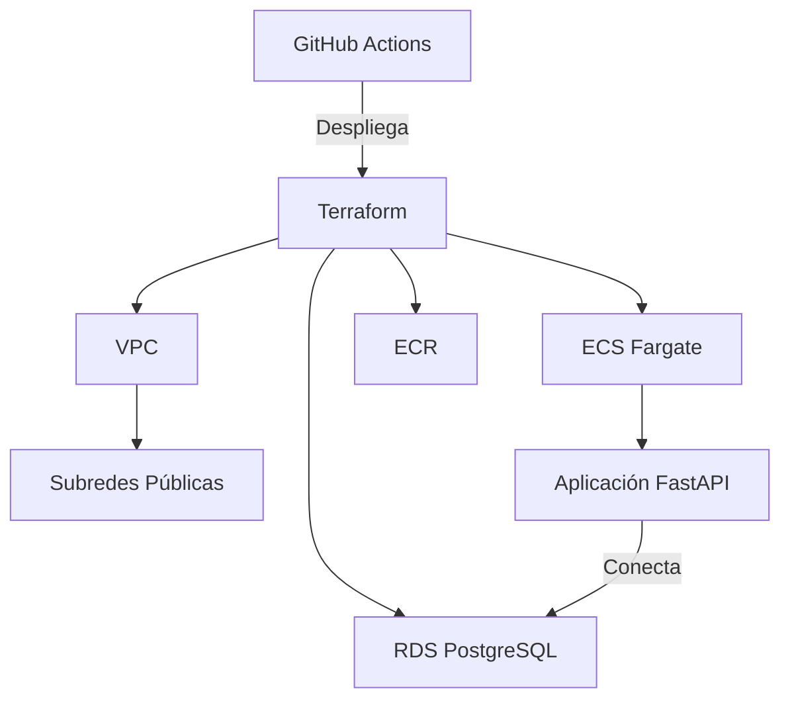

#  Aplicación Web en AWS Free Tier

[](https://github.com/marioJRDZGarcia/free-tier-app/actions)
[](https://www.terraform.io/)
[](https://aws.amazon.com/free/)

Este proyecto demuestra cómo desplegar una aplicación web en **AWS utilizando solo servicios gratuitos**, implementando infraestructura como código con Terraform y automatizando el despliegue con GitHub Actions.

##  Requisitos Previos

- Cuenta de AWS con [Free Tier activo](https://aws.amazon.com/free/)
- GitHub Account
- [Git instalado](https://git-scm.com/downloads) (opcional para desarrollo local)

##  Arquitectura




Componentes principales:
- **Frontend**: Aplicación FastAPI en contenedor Docker
- **Infraestructura**: 
  - VPC con subredes públicas
  - ECS Fargate (sin servidores)
  - RDS PostgreSQL (db.t3.micro)
  - ECR para almacenar imágenes Docker
- **CI/CD**: GitHub Actions con autenticación OIDC

##  Configuración Inicial

1. **Clona el repositorio**:
   ```bash
   git clone https://github.com/marioJRDZGarcia/free-tier-app.git
   cd free-tier-app
   ```

2. **Configura secrets en GitHub**:
   - Ve a `Settings > Secrets > Actions`
   - Agrega estos secrets:
     - `AWS_ACCOUNT_ID`: Tu ID de cuenta AWS
     - `DB_USERNAME`: Usuario para PostgreSQL
     - `DB_PASSWORD`: Contraseña para PostgreSQL

3. **Configura OIDC en AWS** (una sola vez):
   - Crea un Identity Provider en IAM:
     - Provider URL: `https://token.actions.githubusercontent.com`
     - Audience: `sts.amazonaws.com`

##  Despliegue

### 1. Desplegar Infraestructura
Ejecuta manualmente el workflow **"Deploy Infrastructure"** en GitHub Actions o haz push a `main`:
```bash
git add .
git commit -m "Trigger infrastructure deployment"
git push origin main
```

### 2. Desplegar Aplicación
Ejecuta el workflow **"Deploy Application"** después de que la infraestructura esté lista.

### 3. Acceder a la Aplicación
1. Obtén la IP pública de tu servicio:
   - Ve a [ECS Console](https://console.aws.amazon.com/ecs/)
   - Busca la tarea en ejecución
   - Copia la dirección IP pública

2. Accede a los endpoints:
   - `http://<IP_PUBLICA>:8000` - Página principal
   - `http://<IP_PUBLICA>:8000/health` - Health check
   - `http://<IP_PUBLICA>:8000/db-check` - Verifica conexión a DB

##  Limpieza
Para eliminar todos los recursos y evitar cargos:
1. Ejecuta el workflow **"Destroy Infrastructure"**
2. Verifica en la consola de AWS que todos los recursos se hayan eliminado

##  Estructura del Proyecto
```
.
├── .github/workflows/    # Pipelines CI/CD
├── app/                  # Código fuente Python
├── terraform/            # Infraestructura como código
├── .gitignore
└── README.md
```

##  Troubleshooting
- **Error de permisos**: Verifica que el rol de OIDC esté correctamente configurado
- **RDS no accesible**: Revisa los security groups y subredes públicas
- **Imagen no encontrada**: Verifica que el workflow de la aplicación se ejecutó después del de infraestructura

##  Licencia
Este proyecto está bajo licencia [MIT](LICENSE).

---

**Nota**: Todos los recursos utilizados están dentro del [AWS Free Tier](https://aws.amazon.com/free/). Monitorea tu uso en la consola de AWS.
```

### Características clave del README:
1. **Badges visuales** para estado del pipeline y tecnologías
2. **Diagrama de arquitectura** (puedes reemplazar la URL por tu propio diagrama)
3. **Instrucciones paso a paso** con comandos exactos
4. **Sección de troubleshooting** con problemas comunes
5. **Estructura del proyecto** clara
6. **Notas importantes** sobre Free Tier

Para completarlo:
1. Si quieres agregar un diagrama real, puedes usar [draw.io](https://app.diagrams.net/) y subirlo a Imgur
2. Agrega capturas de pantalla de:
   - La consola de ECS con tu servicio corriendo
   - La aplicación funcionando en el navegador
   - Los workflows exitosos en GitHub Actions